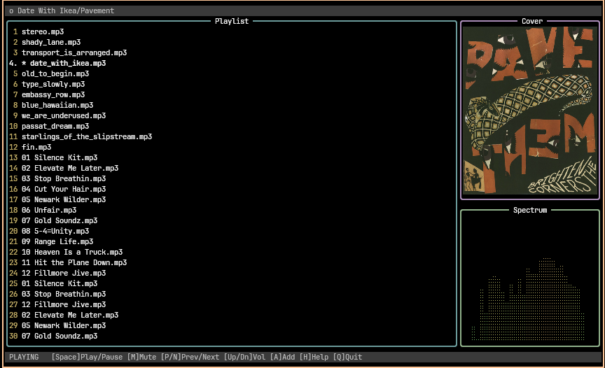
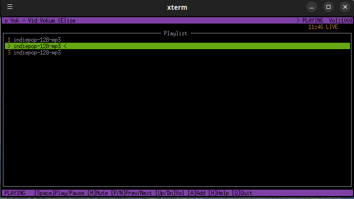
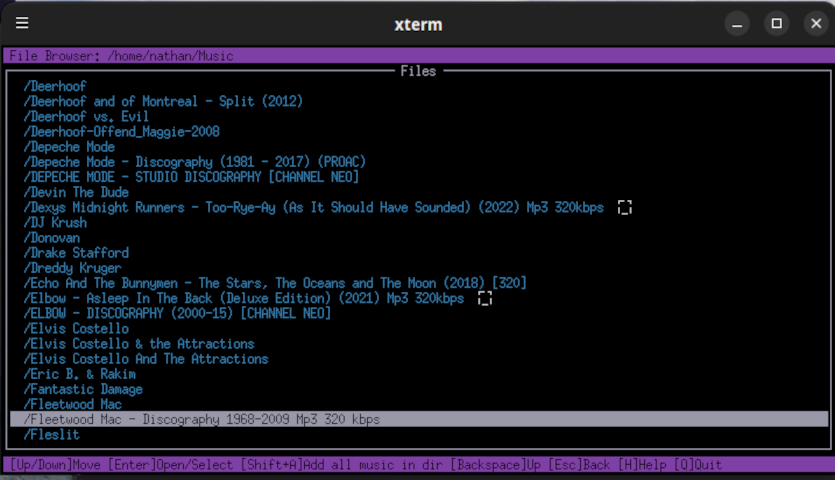
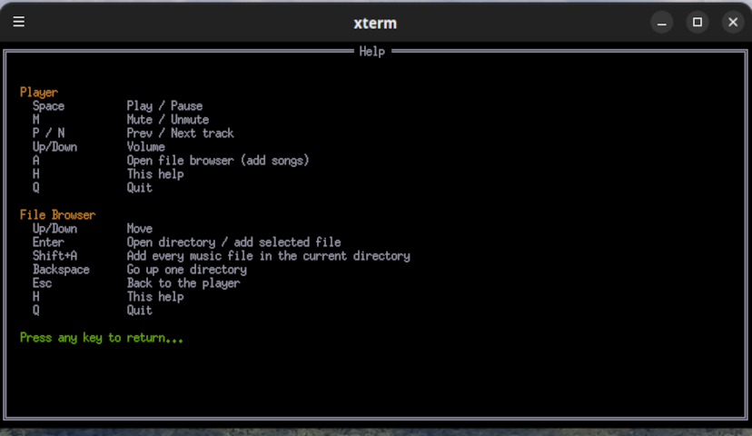

# muzak321

A command-line music player (MP3, FLAC, OGG, WAV) built with [tview](https://github.com/rivo/tview), featuring a file browser, progress bar, and playlist display. It can also stream live Internet radio (SHOUTcast/Icecast MP3) and reads MP3/FLAC/OGG audio tags to show **Title / Artist** while playing.


## Dependencies

- Go 1.21+

It is built on a few great Go packages:

| Package | What it provides |
| --- | --- |
| [tview](https://github.com/rivo/tview) | Terminal UI (player, file browser, playlist) |
| [tcell](https://github.com/gdamore/tcell/v2) | Low-level terminal handling under tview |
| [beep](https://github.com/faiface/beep) | Decoding & playback engine |
| [go-mp3](https://github.com/hajimehoshi/go-mp3) | MP3 decoding (incl. live streams) |
| [tag](https://github.com/dhowden/tag) | MP3/FLAC/OGG metadata for the **Title / Artist** display |

## Build

```bash
go build -o muzak321 .
```

## Usage

```
muzak321 -f <file>                   Play a file, playlist, stream URL, directory, or glob
muzak321 -s                          Shuffle playback
muzak321 -v, --version               Show version
muzak321                             File browser mode

  -f accepts:
    song.mp3            single audio file (mp3, flac, ogg, wav)
    playlist.m3u        M3U playlist (tracks play one by one)
    stations.pls        PLS stream playlist (remote streams + local tracks)
    http://...          live MP3 stream (SHOUTcast/Icecast)
    /path/to/music/     directory (walked recursively for audio / .m3u / .pls)
    '*.flac'            glob pattern (shell wildcards)
    '1_*.mp3'           wildcard matching

Controls:
  Space    Play / Pause
  M        Mute / Unmute
  P / N    Prev / Next track
  Up/Down  Volume
  A        Add songs (opens the file browser)
  H        Help
  Q        Quit

File browser:
  Up/Down     Move
  Enter       Open a directory / add the selected file
  Shift+A     Add every music file in the current directory
  Backspace   Go up one directory
  Esc         Back to the player
  H           Help
  Q           Quit
```

The player screen shows the current track, a live progress bar with elapsed/duration
time, and the playlist with the current track highlighted. Volume defaults to 80%.

For local files, the header shows the audio tag as **Title / Artist** when available
(MP3, FLAC, OGG), falling back to the file name. `.pls` playlists are resolved
relative to the playlist file, so they work with both local tracks and remote URLs.

When a remote stream is playing, the header shows the live **StreamTitle** from the
server's ICY metadata (falling back to a friendly URL name), the progress bar turns
into a **LIVE** indicator with elapsed time, and **Prev** is disabled (a live stream
cannot be rewound). Next and the rest of the controls behave as usual.

Press **A** during playback to open the file browser and add songs to the current
playlist. Browsing a directory does **not** add anything — press **Shift+A** while
a directory is open to add every music file it contains (including playlists).
In the standalone file browser (running `muzak321` with no arguments), selecting a
file or pressing Shift+A starts playback with those tracks.

## Audio requirements

Playback uses beep/Oto, which on Linux talks to ALSA. The Snap Store build
handles both setups automatically — it routes ALSA through PulseAudio when a
PulseAudio or PipeWire-pulse server is running, and falls back to direct ALSA
otherwise. Building from source, one of these is needed:

**Option A — ALSA with PulseAudio/PipeWire (recommended)**

Install an audio server that provides an ALSA compatibility layer:

```bash
# For PulseAudio
sudo apt-get install pulseaudio libasound2-plugins alsa-utils

# For PipeWire
sudo apt-get install pipewire pipewire-pulse pipewire-alsa wireplumber alsa-utils
```

This routes ALSA through a per-user audio server, so no special group is needed.

**Option B — Direct ALSA access**

Add yourself to the `audio` group and log out/in:

```bash
sudo usermod -a -G audio $USER
```

If playback fails, the app shows a diagnostic message indicating the likely cause (permissions, missing hardware, etc.).

## Custom Themes

muzak321 reads an optional theme file at
`$XDG_CONFIG_HOME/muzak321/theme.conf` (falling back to
`~/.config/muzak321/theme.conf` if `XDG_CONFIG_HOME` isn't set). If the
file doesn't exist, the built-in pale/muted color scheme is used
unchanged.

Format: one `key = #rrggbb` pair per line. Blank lines and lines starting
with `#` are ignored.

```conf
# ~/.config/muzak321/theme.conf
header_bg = #3a3a3a
header_fg = #c0c0c0
```

Any line with an unknown key or an invalid color prints a warning to
stderr and keeps that key's default — it never stops the app from
starting.

Available keys and their defaults:

| Key | Default | Controls |
| --- | --- | --- |
| `header_bg` | `#3a3a3a` | Header/status bar background |
| `header_fg` | `#c0c0c0` | Header/status bar text |
| `error_bg` | `#a86b6b` | Status bar background on error |
| `bar_fill_bg` | `#2a2a2a` | Progress bar track background |
| `bar_fill_fg` | `#6b9b8f` | Progress bar filled portion |
| `accent_amber` | `#c9b46b` | Hints, track numbers, headings |
| `accent_teal` | `#6b9b9b` | Directory entries in the file browser |
| `border_playlist` | `#6b9b9b` | Playlist panel border |
| `border_coverart` | `#a88bb5` | Cover art panel border |
| `border_spectrum` | `#8fb08a` | Spectrum panel border |
| `spectrum_low` | `#5fb05f` | Spectrum color at 0% level |
| `spectrum_mid` | `#b0b05f` | Spectrum color at 50% level |
| `spectrum_high` | `#b05f5f` | Spectrum color at 100% level |
| `body_bg` | `#000000` | Progress/spectrum/cover art panel backgrounds |
| `playlist_selected_fg` | `#ffffff` | Selected playlist row text |
| `playlist_selected_bg` | `#000000` | Selected playlist row background |
| `browser_selected_fg` | `#000000` | Selected file-browser row text |
| `browser_selected_bg` | `#ffffff` | Selected file-browser row background |

## Screen Shots








